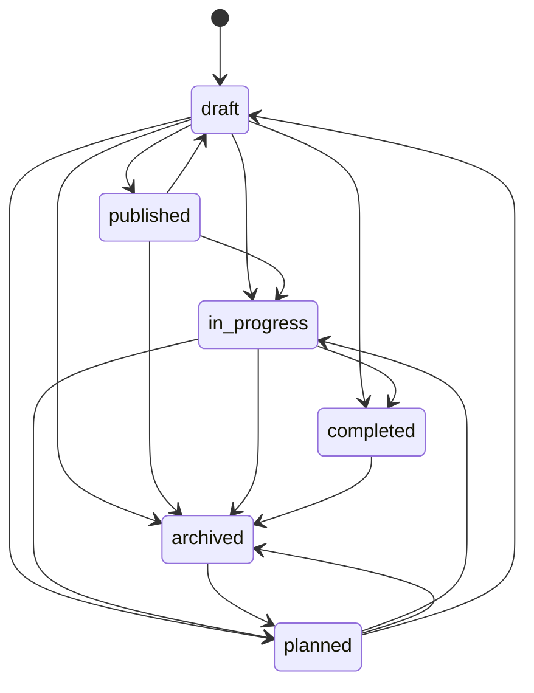

# SynqForge Backlog Engine

## Overview

The Backlog Engine provides automatic epic progress tracking, sprint velocity calculation, and forecast capabilities for SynqForge. All aggregate calculations are handled by database triggers for maximum performance and consistency.

## Features

### 1. Epic Progress Tracking
- **Auto-calculated aggregates**: Total stories, completed stories, total points, completed points, progress percentage
- **Real-time updates**: Progress updates automatically when stories change
- **Status validation**: Enforces valid epic status transitions
- **Story breakdowns**: Detailed analysis by status and type

### 2. Sprint Velocity
- **Accurate velocity calculation**: Based on story completion within sprint date boundaries
- **Cached for performance**: Velocity values cached and updated by triggers
- **Historical tracking**: Complete velocity history per project
- **Rolling averages**: Calculate 3-sprint and 5-sprint averages

### 3. Forecasting
- **Linear forecasting**: Predict future sprint velocity based on rolling averages
- **Confidence levels**: High/Medium/Low confidence based on historical data
- **Customizable basis**: Use 3-sprint or 5-sprint averages

## Database Schema

### New Columns

#### `epics` table
```sql
total_stories         INT          -- Auto-calculated count of all stories
completed_stories     INT          -- Auto-calculated count of done/archived stories
total_points          INT          -- Auto-calculated sum of all story points
completed_points      INT          -- Auto-calculated sum of done/archived story points
progress_pct          NUMERIC(5,1) -- Auto-calculated progress percentage
```

#### `stories` table
```sql
done_at               TIMESTAMPTZ  -- Timestamp when story was marked done/archived
```

#### `sprints` table
```sql
velocity_cached       INT          -- Cached velocity (sum of completed points in date range)
```

### Database Triggers

1. **Epic Aggregate Trigger** (`trigger_epic_aggregates`)
   - Fires on: INSERT, UPDATE, DELETE of stories
   - Updates: Epic aggregate columns (totals, completion, progress_pct)
   - Performance: Uses affected epic detection to minimize updates

2. **Story done_at Trigger** (`maintain_story_done_at`)
   - Fires on: UPDATE of story status
   - Updates: Sets/clears done_at timestamp based on status
   - Logic: Sets done_at when moving TO done/archived, clears when moving FROM

3. **Sprint Velocity Cache Trigger** (`trigger_sprint_velocity_cache`)
   - Fires on: Changes to stories or sprint_stories
   - Updates: Sprint velocity_cached field
   - Calculation: Sum of completed story points within sprint date range

### Views

#### `view_sprint_velocity`
Efficient query for sprint velocity metrics:
```sql
SELECT
  sprint_id,
  project_id,
  organization_id,
  completed_points,
  completed_stories,
  committed_points,
  committed_stories
FROM view_sprint_velocity
WHERE project_id = 'xxx'
```

#### `view_project_velocity_history`
Aggregate velocity statistics per project:
```sql
SELECT
  project_id,
  completed_sprints,
  avg_velocity,
  min_velocity,
  max_velocity,
  velocity_stddev,
  rolling_avg_3,
  rolling_avg_5
FROM view_project_velocity_history
WHERE project_id = 'xxx'
```

## API Endpoints

### Epic Progress

#### `GET /api/epics/[epicId]/progress`
Get epic progress summary with story breakdown.

**Response:**
```json
{
  "success": true,
  "data": {
    "epic": {
      "id": "epic-123",
      "title": "User Authentication",
      "status": "in_progress",
      "totalStories": 12,
      "completedStories": 8,
      "totalPoints": 45,
      "completedPoints": 30,
      "progressPct": "66.7",
      "startDate": "2025-01-01",
      "targetDate": "2025-03-01"
    },
    "breakdown": {
      "byStatus": {
        "done": 8,
        "in_progress": 3,
        "backlog": 1
      },
      "byType": {
        "feature": 10,
        "bug": 2
      },
      "avgPointsPerStory": 3.8,
      "storiesWithoutPoints": 1
    }
  }
}
```

#### `POST /api/epics/[epicId]/status`
Update epic status with validation.

**Request:**
```json
{
  "status": "completed",
  "force": false
}
```

**Response:**
```json
{
  "success": true,
  "data": {
    "epic": { ... },
    "message": "Epic status updated to 'completed'"
  }
}
```

#### `GET /api/epics/[epicId]/status`
Get valid next statuses for an epic.

**Response:**
```json
{
  "success": true,
  "data": {
    "currentStatus": "in_progress",
    "validNextStatuses": ["completed", "planned", "archived"]
  }
}
```

### Sprint Velocity

#### `GET /api/sprints/[sprintId]/velocity`
Get comprehensive sprint velocity summary.

**Response:**
```json
{
  "success": true,
  "data": {
    "sprint": {
      "id": "sprint-456",
      "name": "Sprint 12",
      "goal": "Complete authentication",
      "status": "completed",
      "startDate": "2025-01-01",
      "endDate": "2025-01-14"
    },
    "velocity": {
      "completedPoints": 42,
      "completedStories": 12,
      "committedPoints": 50,
      "committedStories": 15,
      "completionRate": 84
    },
    "projectMetrics": {
      "rollingAvg3": 40,
      "rollingAvg5": 38,
      "allTimeAvg": 35,
      "minVelocity": 25,
      "maxVelocity": 50,
      "totalCompletedSprints": 11
    },
    "forecast": [
      {
        "sprintIndex": 1,
        "predictedPoints": 40,
        "basis": "rolling_avg_3",
        "confidence": "high"
      },
      {
        "sprintIndex": 2,
        "predictedPoints": 40,
        "basis": "rolling_avg_3",
        "confidence": "high"
      },
      {
        "sprintIndex": 3,
        "predictedPoints": 40,
        "basis": "rolling_avg_3",
        "confidence": "high"
      }
    ]
  }
}
```

### Project Velocity

#### `GET /api/projects/[projectId]/velocity`
Get project velocity rolling average and forecast.

**Query Parameters:**
- `sprints` (default: 3) - Number of sprints for rolling average
- `forecast` (default: 3) - Number of future sprints to forecast
- `mode` (default: summary) - 'summary' or 'history'

**Response (mode=summary):**
```json
{
  "success": true,
  "data": {
    "rollingAverage": 40,
    "basis": "last_3_sprints",
    "forecast": [
      {
        "sprintIndex": 1,
        "predictedPoints": 40,
        "basis": "rolling_avg_3",
        "confidence": "high"
      }
    ]
  }
}
```

**Response (mode=history):**
```json
{
  "success": true,
  "data": {
    "projectId": "proj-789",
    "organizationId": "org-123",
    "completedSprints": 11,
    "avgVelocity": 35,
    "minVelocity": 25,
    "maxVelocity": 50,
    "velocityStddev": 8,
    "rollingAvg3": 40,
    "rollingAvg5": 38
  }
}
```

## Services

### `epicProgressService`

```typescript
import { epicProgressService } from '@/lib/services/epic-progress.service'

// Get epic progress
const progress = await epicProgressService.getEpicProgress(epicId, organizationId)

// Get detailed summary
const summary = await epicProgressService.getEpicProgressSummary(epicId, organizationId)

// Update epic status
const updated = await epicProgressService.updateEpicStatus(epicId, organizationId, 'completed', false)

// Check status transition validity
const isValid = epicProgressService.isValidStatusTransition('draft', 'completed', false)

// Get valid next statuses
const nextStatuses = epicProgressService.getValidNextStatuses('in_progress')
```

### `velocityService`

```typescript
import { velocityService } from '@/lib/services/velocity.service'

// Calculate sprint velocity
const velocity = await velocityService.calculateSprintVelocity(sprintId, organizationId)

// Get rolling average
const avg = await velocityService.getRollingVelocity(projectId, organizationId, 3)

// Forecast future sprints
const forecast = await velocityService.forecastVelocity(projectId, organizationId, 3, 3)

// Get sprint summary
const summary = await velocityService.getSprintVelocitySummary(sprintId, organizationId)

// Get project history
const history = await velocityService.getProjectVelocityHistory(projectId, organizationId)
```

## Migration & Deployment

### Running Migrations

```bash
# Generate migrations (if schema changed)
npm run db:generate

# Apply migrations
npm run db:migrate

# Or use drizzle-kit directly
npx drizzle-kit push
```

### Migration Order

Migrations must be applied in order:
1. `0013_add_epic_aggregates.sql` - Add epic aggregate columns
2. `0014_add_story_completion_tracking.sql` - Add done_at to stories
3. `0015_add_sprint_velocity_cache.sql` - Add velocity cache to sprints
4. `0016_add_backlog_triggers.sql` - Create all triggers
5. `0017_add_velocity_view.sql` - Create views

### Backfilling Data

The migrations include automatic backfilling:
- Epic aggregates will be calculated on next story change (or manually trigger)
- Story done_at will be backfilled from updated_at for existing done stories
- Sprint velocity_cached will be backfilled from existing data

### Performance Considerations

- **Triggers are lightweight**: Only affected epics/sprints are updated
- **Indexed properly**: All aggregate queries use indexes
- **Cached values**: Sprint velocity cached for fast reads
- **Views for complex queries**: Use pre-defined views for best performance

## Epic Status Transitions



### Status Definitions

- **draft**: Initial state, stories can be added/modified freely
- **published**: Epic is visible and ready for planning
- **planned**: Epic scheduled for execution
- **in_progress**: Active development
- **completed**: All work finished
- **archived**: Epic closed (can be reactivated)

## Best Practices

### Epic Management

1. **Start in draft**: Create epics in draft status to allow flexibility
2. **Monitor progress**: Use progress_pct to track completion
3. **Validate transitions**: Use status validation endpoints before updating
4. **Review breakdowns**: Check story breakdown by status/type regularly

### Velocity Tracking

1. **Mark stories done promptly**: done_at is set automatically when status changes
2. **Use consistent sprint lengths**: For accurate velocity comparison
3. **Monitor rolling averages**: Use 3-sprint and 5-sprint for short/long-term trends
4. **Review forecasts regularly**: Adjust planning based on forecast confidence

### Performance Optimization

1. **Trust the cache**: Use velocityCached instead of recalculating
2. **Use views**: Query view_sprint_velocity instead of joining manually
3. **Batch updates**: Triggers handle bulk changes efficiently
4. **Monitor slow queries**: Check for missing indexes if queries slow down

## Troubleshooting

### Epic aggregates not updating

```sql
-- Manually trigger epic recalculation
SELECT recalc_epic_aggregates('epic-id-here');
```

### Sprint velocity cache not updating

```sql
-- Manually update sprint velocity cache
SELECT update_sprint_velocity_cache('sprint-id-here');
```

### Check trigger status

```sql
-- List all triggers
SELECT trigger_name, event_manipulation, event_object_table
FROM information_schema.triggers
WHERE trigger_schema = 'public'
  AND event_object_table IN ('stories', 'epics', 'sprints', 'sprint_stories');
```

### Verify done_at is set correctly

```sql
-- Check stories marked done without done_at
SELECT id, title, status, done_at
FROM stories
WHERE status IN ('done', 'archived')
  AND done_at IS NULL;
```

## Future Enhancements

### Planned Features

1. **Monte Carlo Forecasting**: Replace linear forecast with probability-based simulation
2. **Velocity Trend Analysis**: Detect acceleration/deceleration trends
3. **Epic Health Score**: Combine progress, timeline, and story quality metrics
4. **Sprint Commitment Recommendations**: Suggest story allocation based on velocity
5. **Burndown/Burnup Charts**: Real-time sprint progress visualization
6. **Story Aging Alerts**: Notify when stories remain in status too long

### Integration Points

- **Notifications**: Alert on epic status changes
- **Analytics Dashboard**: Visualize velocity trends
- **AI Insights**: Use velocity data for planning suggestions
- **Reports**: Export velocity reports for stakeholders

## References

- [Drizzle ORM Documentation](https://orm.drizzle.team/docs/overview)
- [PostgreSQL Trigger Documentation](https://www.postgresql.org/docs/current/sql-createtrigger.html)
- [Agile Velocity Metrics](https://www.scrum.org/resources/blog/velocity-metric)
